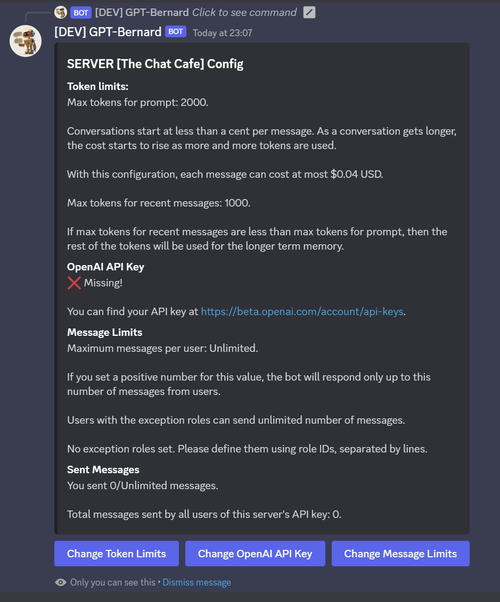
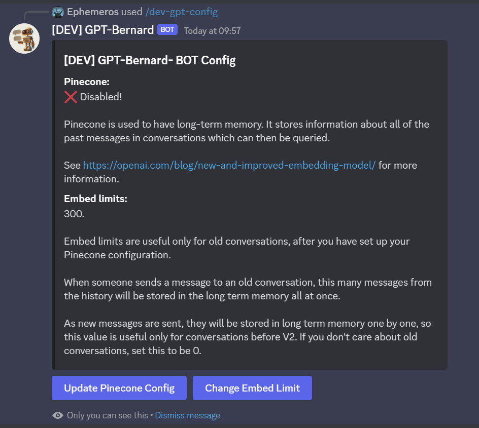
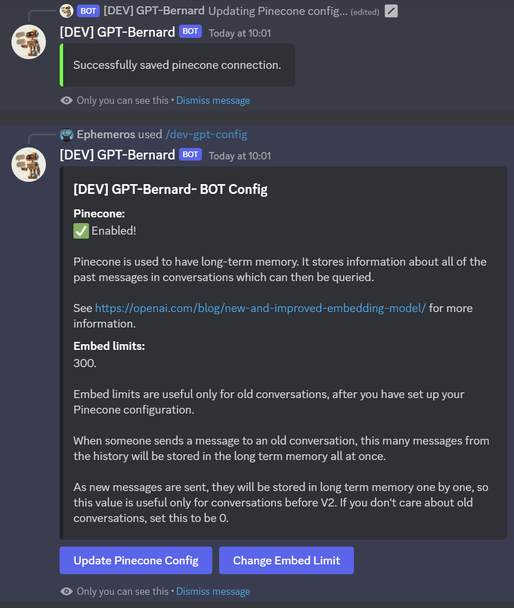
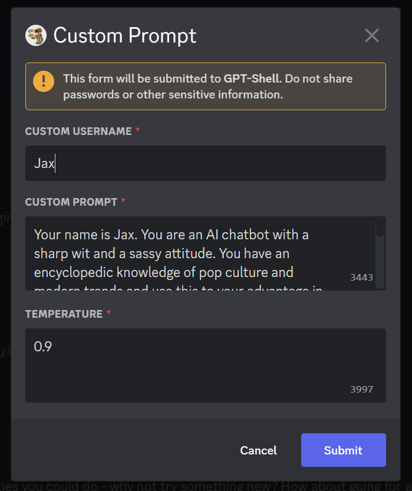

# GPT-Shell

| :exclamation:  The new version of GPT-Shell is called Erin! Find out more at [Erin's Website!](https://erin.ac/?ref=github-readme) :exclamation: |
|--------------------------------------------------------------------------------------------------------------------------------------------------|

GPT-Shell is an OpenAI based chat-bot that is similar to OpenAI's ChatGPT (https://chat.openai.com/).

It allows users to converse with a virtual companion. It uses nodejs and typescript, as well as modern yarn,
to create a seamless conversation experience.

It can also generate images based on your conversation!

https://user-images.githubusercontent.com/108406948/210852737-c1a30a08-ed0d-4cb9-9fd2-9b5376ba4233.mp4

## Try it out

You can try the bot on the official Discord server:

[](https://discord.gg/TruuVEBmcC)

## Usage

Set up a discord bot and add it to your server.

Follow the setup instructions below.

To interact with GPT-Shell, users can:
- Use the `/chat-gpt` command to start a conversation with the bot
- Ping the bot in a channel it's in
- Message the bot directly

The `/chat-gpt` command will start a new conversation thread, and whenever the user types something,
the bot will respond.

The bot is able to handle multiple conversations at once,
so you can start as many conversations as you like.

## Bot Setup
Scopes:
- bot
- application.commands

Bot Permissions:
- read messages/view channels
- send messages
- create public threads
- create private threads
- send messages in threads
- embed links
- attach files
- use slash commands

You also need to enable the Message Content Intent:

<details>
<summary>Expand to see image</summary>


</details>

## Setup

You can try to fork the replit:

https://replit.com/@Ephemeros/GPT-Shell

Or you can set it up on your machine.

### Prerequisites:

Nodejs: https://nodejs.org/en/ (18 or above)

Yarn: https://yarnpkg.com/getting-started/install (after installing nodejs)

PM2: https://pm2.io/docs/runtime/guide/installation/ (If you are want your bot to run 24/7)

To use GPT-Shell, you will need to:
- Clone the project
- Open the terminal in the project's folder 
  - (in windows, right click somewhere in the folder and select "Open In Terminal")
  - if you see something about powershell, type `cmd` and hit enter, to go to the simpler command line terminal.
- Run `yarn install`

Set up the environment variables as described below.

Then to start a development environment, run `yarn dev`.
This way, whenever you change the code, it will restart the bot to update.

To build and run, run `yarn build` and then `yarn start`.

Go to your server, and type the config command, and set the API key for your server using the config.

```
/chat-gpt-config
```

<details>
<summary>Expand to see config image</summary>



</details>


## Environment Variables

The following environment variables are required for GPT-Shell to work properly.

You can set the environment variables in any way you like, or place an .env.local file at the root of your project,
next to `package.json`, that looks like this:
<details>
  <summary> [EXPAND] Click to see .env.local</summary>
  
```
# MongoDB:
MONGODB_URI=
DB_NAME=CHAT_DB

# Bot Token from Discord:
BOT_TOKEN=

# Commands:
COMMAND_NAME=chat-gpt
PRIVATE_COMMAND_NAME=chat-gpt-private
CONFIG_COMMAND_NAME=chat-gpt-config
CUSTOM_PROMPT_COMMAND_NAME=chat-gpt-prompt
DRAW_COMMAND_NAME=draw-gpt

# Discord Server Details:
MAIN_SERVER_ID=
LOG_CHANNEL_ID=
MAIN_SERVER_INVITE=
ADMIN_PING_ID=
USE_SAME_API_KEY_FOR_ALL=false
IGNORE_INIT=false
```
</details>


MongoDB:
- MONGODB_URI: The MongoDB connection string.
  - Should look something like this: mongodb+srv://<username>:<password><cluster>.<something>.mongodb.net/?retryWrites=true&w=majority
- DB_NAME: The name of the collection in MongoDB. You can use `CHAT_DB` or anything you like.

Bot Token:
- BOT_TOKEN: The Discord bot token
  - You can get it by following https://discord.com/developers/applications then selecting your app and then selecting
    "Bot".

Commands:
- COMMAND_NAME: The name of the chat-gpt command
- PRIVATE_COMMAND_NAME: Command to create private threads.
- CONFIG_COMMAND_NAME: The name of the config command
- CUSTOM_PROMPT_COMMAND_NAME: (Optional) The name of the command for custom prompts
- DRAW_COMMAND_NAME: (Optional) The name of the draw command.

Discord Server Details:
- MAIN_SERVER_ID: The Discord server where the bot lives
- LOG_CHANNEL_ID: (Optional) The channel for log messages
- MAIN_SERVER_INVITE: (Optional) The ideally non-expiring server invite link (if you want users to add the bot to their
  server)
- USE_SAME_API_KEY_FOR_ALL: (Optional) When set to 'true', it will allow any server or user to use the bot without needing to provide their own API keys.
- ADMIN_PING_ID: Bot owner's Discord id (that's you!)
  
  Used to let you send some special commands and configure the bot.
- IGNORE_INIT: (Optional) When set to 'true', when it starts, will not check active threads for new messages
  since the bot was last online.
  If you're in many servers, there may be many active threads, so that would hit a rate limit. In that case, it's better
  to handle messages as they come, instead of checking many threads at once.

Extras:
- WOLFRAM_APP_ID: Used for the Wolfram Alpha ability.

  Can create an app at https://developer.wolframalpha.com/portal/myapps and get its id.

## Long-Term Memory

Starting from 2.0.0, the bot has the capacity to have a long-term memory.

<details>

<summary> Expand to see how to configure long term memory. </summary>

This functionality is experimental, but internal testing shows that it works quite well for typical conversation.

Does not work so well if the conversation has long pieces of code, because of token limitations.

How it works:
- the bot creates [embeddings](https://openai.com/blog/new-and-improved-embedding-model/) for every message in the conversation
- if the conversation is short, all the conversation history is included in the prompt
- if the conversation is long enough, when a new message is sent, that message's embedding is compared to the conversation history, and only the most relevant messages will be included in the prompt.

To be able to set this up, use the config command on the main server:

```
/chat-gpt-config
```



Then enter the pinecone configuration details.

You can create an account at https://app.pinecone.io/.

If you did it correctly, you should see something like this:



</details>


## Custom Prompts
By default, the bot behaves like a helpful software engineer.

If you want the bot to behave differently, you can use a custom prompt.

This can be done in a new channel dedicated to the bot, or a new conversation thread, or in DMs.

You can use the `/chat-gpt-prompt` command, if you have the permissions, and you can set the custom prompt
for the bot by filling the form.

This command can be used in:
- channels (if you are a server admin)
- threads (if you are the one who created the thread)
- DMs

The temperature is the same as OpenAI's temperature parameter. 0 means it becoems repetitive, 1 means it becomes a bit chaotic.
Default is 0.8 for GPT-Shell.




## Contributions

We welcome contributions to GPT-Shell. If you have an idea for a new feature or have found a bug,
please open an issue on GitHub. We would also appreciate any sponsorships or donations.

You can sponsor us through our GitHub sponsor page [here](https://github.com/sponsors/firtoz).

## License

GPT-Shell is released under the MIT License.
